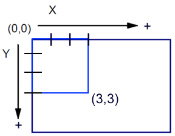

# 🚢💣 VAMOS A HUNDIR EL BARCO 🚢💣

Proyecto **HUNDIR LA FLOTA** realizado por ALDAIR YASSER MC, juego de hundir la flota.

---

## ⚓️ REGLAS DEL JUEGO ⚓️

Solamente tienes que ejecutar [```main.py```](AYMC/main.py)

Si le has dado sin querer, primero te preguntará si quieres jugar, para que tengas la opción de salir.

Si decides jugar, tú y la maquina contaran con **6 barcos** (3 de tamaño 2, 2 de tamaño 3 y 1 de 4), colocados de forma aleatoria.

Seguido te mostrará un menú en el que dependiendo de lo que elijas puedes:

1. Ver tu tablero para ver cómo van tus barcos
2. *(MODO DIOS)* Ver tablero de la **MAQUINA** para ver cómo van sus barcos 
3. Disparar y dar comienzo al juego
4. Salir del juego 

Para disparar te pedira las coordenadas ***(x,y)***, primero te pedirá la *x*, seguido te pedirá la *y*

**!OJO¡**
Las coordenadas funcionan de la siguiente manera:



Si le das al barco de la maquina, volverá a ser tu turno, te mostrará el menú otra vez.

En el que podrás ver tu tablero, entrar al modo dios, disparar de nuevo o salir, elige sabiamente.

Si fallas será turno de la maquina, el cual si acierta volverá a disparar y sino será tu turno.

El juego termina cuando ganas (has tocado todos sus barcos), cuando pierdes (la maquina ha tocado todos tus barcos) o si decides salir en algún punto.

---

## 🗂️ ESTRUCTURA DEL PROYECTO 🗂️

📄 [main.py](AYMC/main.py) --> Llama al menu_juego dando inicio a todo el programa
📄 [menu_juego.py](AYMC/menu_juego.py) --> Muestra el menú del juego y es donde se llaman a las demás funciones
📄 [barco.py](AYMC/barco.py) --> Crea el tamaño de los barcos
📄 [colocar_barcos.py](AYMC/colocar_barcos.py) --> Defino las 2 funciones para colocar barcos de forma aleatoria y verificar que sea válido, que se llama dentro de la primera.
📄 [tablero.py](AYMC/tablero.py) --> Creo tableros vacíos y llama a colocar_barcos, para colocar los barcos de cada jugador, hay comentado diferentes casos de uso para el cierre del ciclo en caso de perder o ganar.
📄 [disparo.py](AYMC/disparo.py) --> Defino funciones como recibir_disparo(), disparar(), puedo_disparar(), he_tocado() y también hay comentado diferentes casos de uso para el cierre del ciclo en caso de perder o ganar.

📁 img --> Carpeta de imagenes para readme

---

## 📚 IBRERIAS Y VERSIONES 📚

Para ejecutar este programa tienes que tener instalado la libreria **numpy**

Comando para Windows:

``` pip install numpy ```

Comando para Mac:

``` pip3 install numpy ```

*version Python 3.13.0*

*version numpy 2.3.3*

